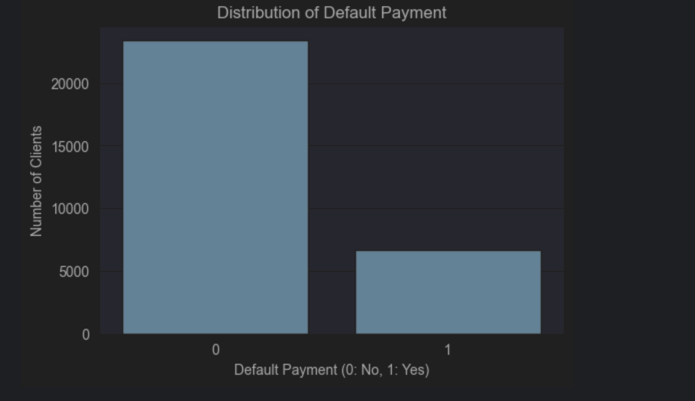
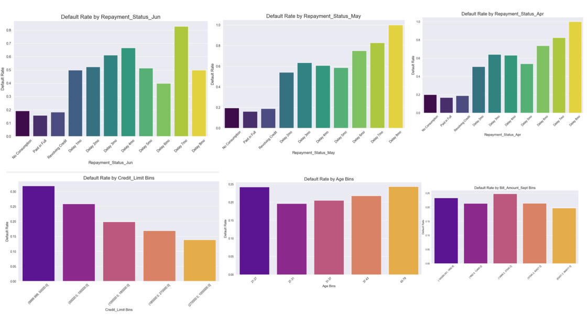
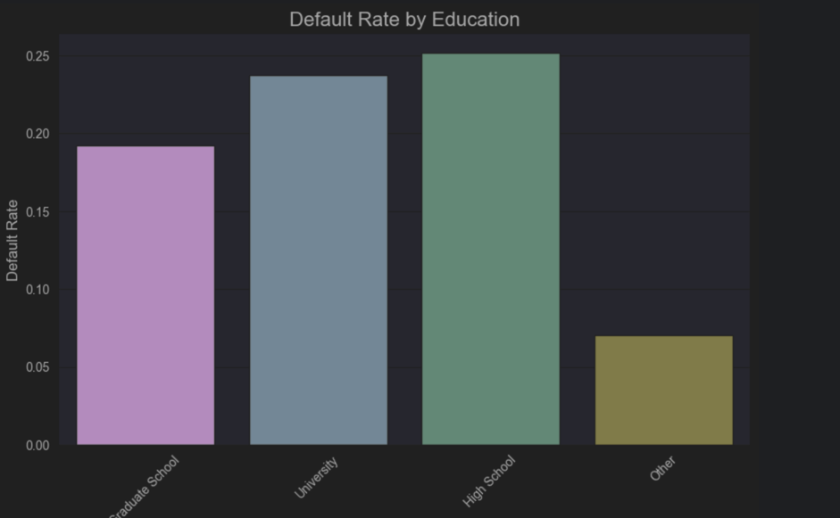
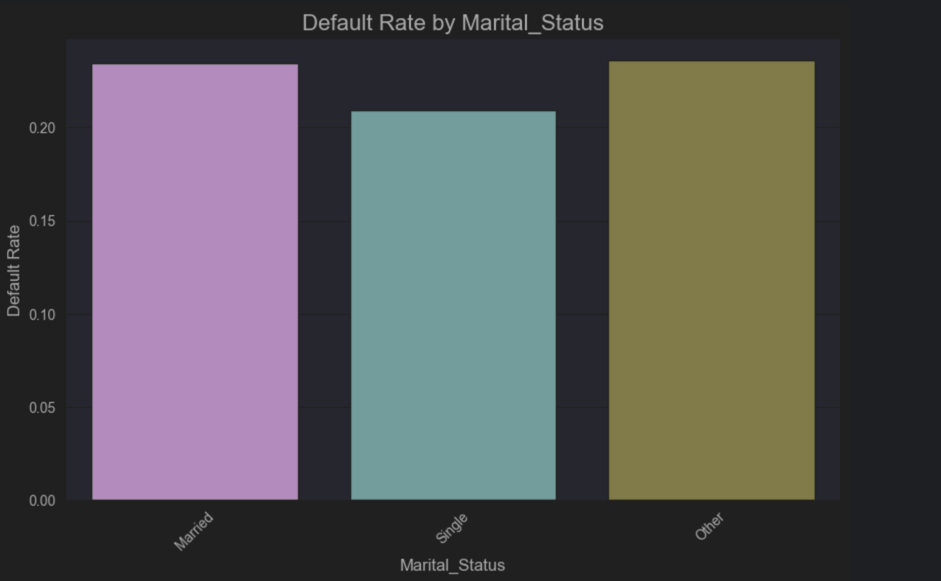
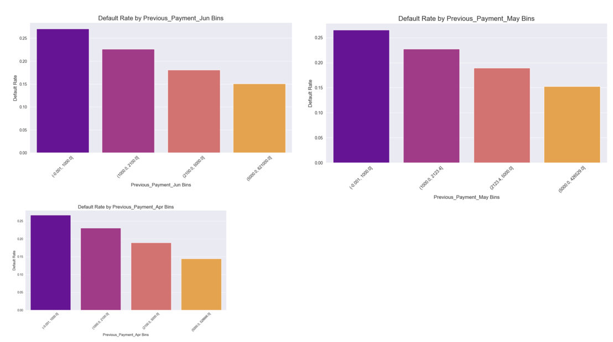
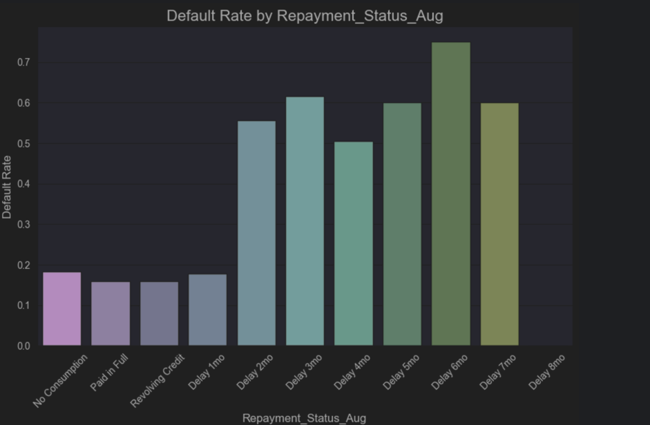
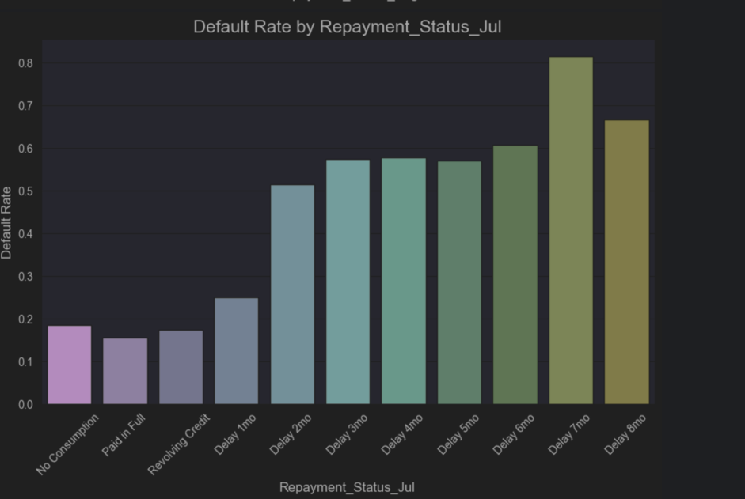
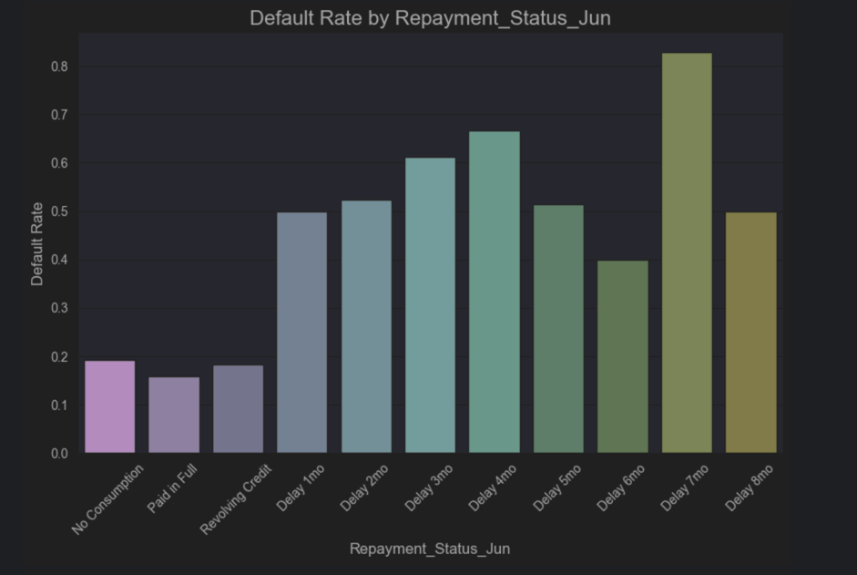
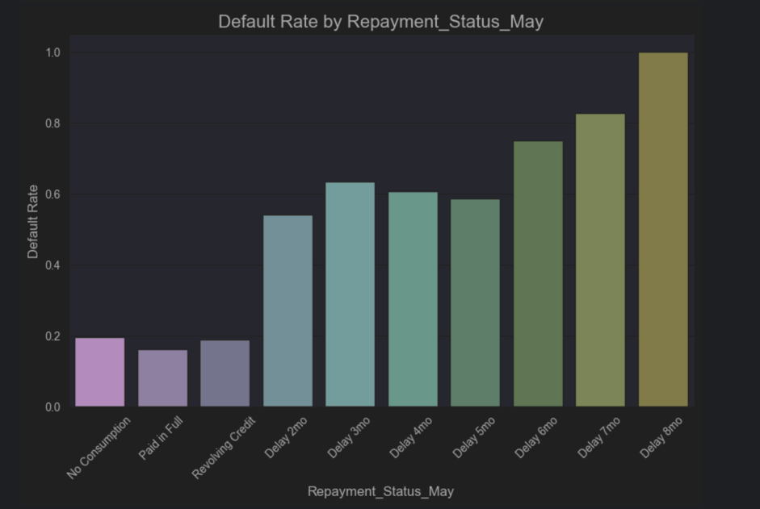
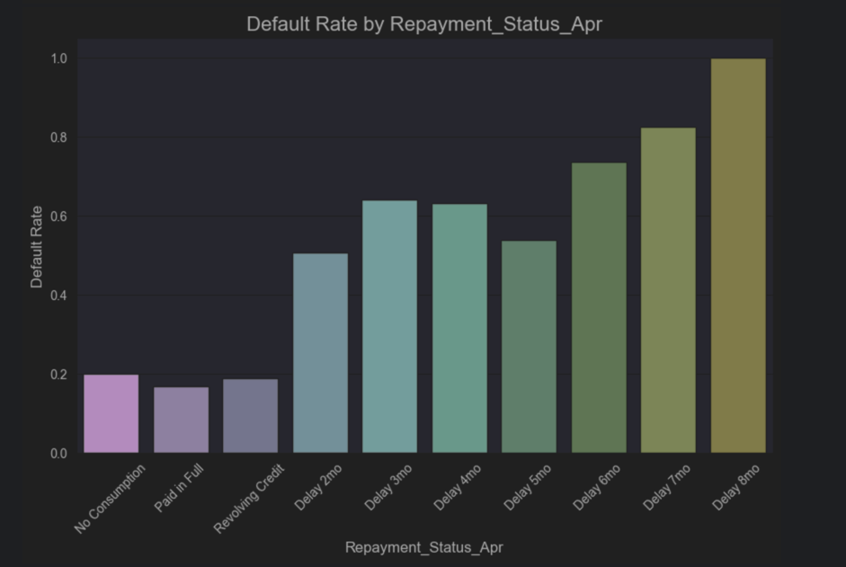

# Credit card default prediction

#### Dataset source: https://www.kaggle.com/datasets/uciml/default-of-credit-card-clients-dataset/data

## Cross-Industry Standard Process for Data Mining (CRISP-DM) methodology
### 1. Business Understanding
- **Objective**: To predict the likelihood of a credit card client defaulting on their next month's payment.
- **Goal**: Enable the financial institution to proactively manage credit risk. This involves making informed decisions like adjusting credit limits, personalizing collection strategies, or flagging high-risk accounts to minimize financial losses.
- **Success Criteria**: A model that provides a reliable probability of default, which can be integrated into the bank's risk management workflow to reduce the rate of actual defaults.

### 2. Data Understanding
- **Data Source**: The project uses the 'UCI Credit Card' dataset, containing information on 30,000 clients from a Taiwanese bank.
- **Initial Data Collection**: The data is loaded from data/UCI_Credit_Card.csv into a pandas DataFrame.
- **Data Exploration**: The dataset includes 25 columns. The target variable is default.payment.next.month. The features consist of:
1. **Client demographics** (SEX, EDUCATION, MARRIAGE, AGE).
2. **Financial standing** (LIMIT_BAL).
3. **History of past payments** (PAY_0, PAY_2 to PAY_6).
4. **Bill statement amounts** (BILL_AMT1 to BILL_AMT6).
5. **Previous payment amounts** (PAY_AMT1 to PAY_AMT6).
- **Initial Data Quality Check**: The data.info() and data.shape commands are used to get an overview of data types, non-null counts, and the dimensions of the dataset.

#### I have performed the following steps for data understanding:
- **Load the data**: Read the UCI_Credit_Card.csv file into a pandas DataFrame.
- **Initial Exploration**: Examine the first few rows, column names, and data types.
- **Descriptive Statistics**: Generate summary statistics for numerical columns to understand their distribution (e.g., mean, median, min, max).
- **Meaningful names** for columns
- **Missing Values**: Check for missing values in each column to identify data quality issues.
- **Target Variable Analysis**: Analyze the distribution of the 'default.payment.next.month' column to spot outliers or skewness.
- **Feature Analysis**:
1. **For categorical features**, I'll examine the unique values and their frequencies.
2. **For numerical features**, I'll look at their distributions using histograms.
- **Correlation Analysis**: Investigate relationships between features and the target variable, 'default.payment.next.month'.

### 3. Data Preparation
After our initial exploration and fine-tuning of the business understanding, it is time to construct our final dataset prior to modeling. Here, we want to make sure to handle any integrity issues and cleaning, the engineering of new features, any transformations that we believe should happen (scaling, logarithms, normalization, etc.), and general preparation for modeling with sklearn.

- **Load the data**: Read the UCI_Credit_Card.csv file into a pandas DataFrame.
- **Initial Exploration**: Examine the first few rows, column names, and data types.
- **Meaningful names** for columns
- **Missing Values**: Check for missing values in each column to identify data quality issues.
- **Target Variable Analysis**: Analyze the distribution of the 'default.payment.next.month' column to spot outliers or skewness.
- **Feature Analysis**:
1. **For categorical features**, I'll examine the unique values and their frequencies.
2. **For numerical features**, I'll look at their distributions using histograms.

#### Exploratory Data Analysis (EDA)
##### Summary of Bar Plots

The bar plots reveal several key trends about the factors influencing credit card defaults:

##### Categorical Features:
- **Repayment Status**: This is clearly the most significant predictor. The default rate rises sharply as the payment delay increases from one month to two or more. Clients who pay in full or have no consumption have a very low risk of default.
- **Gender**: There is a slight difference in default rates between genders, with one gender showing a marginally higher tendency to default.
- **Education**: Default rates vary across education levels. Typically, higher levels of education (like graduate school) are associated with a lower default rate compared to lower levels (like high school).
- **Marital Status**: The default rate differs between married and single clients, with one group showing a slightly higher propensity to default.

##### Numerical Features (Binned):
- **Credit Limit**: There is a strong inverse relationship. Clients in the lowest credit limit bracket have the highest default rate, and the rate consistently decreases as the credit limit increases.
- **Age**: The default rate shows some variation across different age groups. It is often observed that younger clients might have a slightly higher default rate.
- **Bill Amounts**: The trend for bill amounts is not always linear. However, it can sometimes be seen that clients with very low or very high bill amounts relative to their credit limit have different default behaviors.
- **Previous Payments**: Similar to credit limit, there's a noticeable trend here. Clients who make smaller previous payments (relative to their bill amount) tend to have a higher default rate.

These insights are crucial for feature engineering and for understanding the final model's behavior. The repayment status, in particular, stands out as a dominant feature.

### 4. Modeling
#### Modeling approaches
- **Use all 24 features for the prediction**

1. **Models to be used**
- Logistic Regression
- K-Nearest Neighbors
- Decision Tree
- Support Vector Machine

2. **Model will be evaluated based on the below factors**
- Precision
- Recall
- F1 Score
- Accuracy
- Confusion matrix - Minimizing False Positives and False Negatives

3. **If the above factors are not satisfied improve the model with the below technics**
- Hyper parameter tuning with GridSearchCV and RandomizedSearchCV will be performed
- Applying class_weight='balanced'
- Applying class_weight='balanced' along with other configs for the model
- Ensemble methods for better prediction reducing bias and reduce variance (Bagging - High Variance - choose Random Forest, High bias - Boosting - choose AdaBoost/GradientBooster trees)
